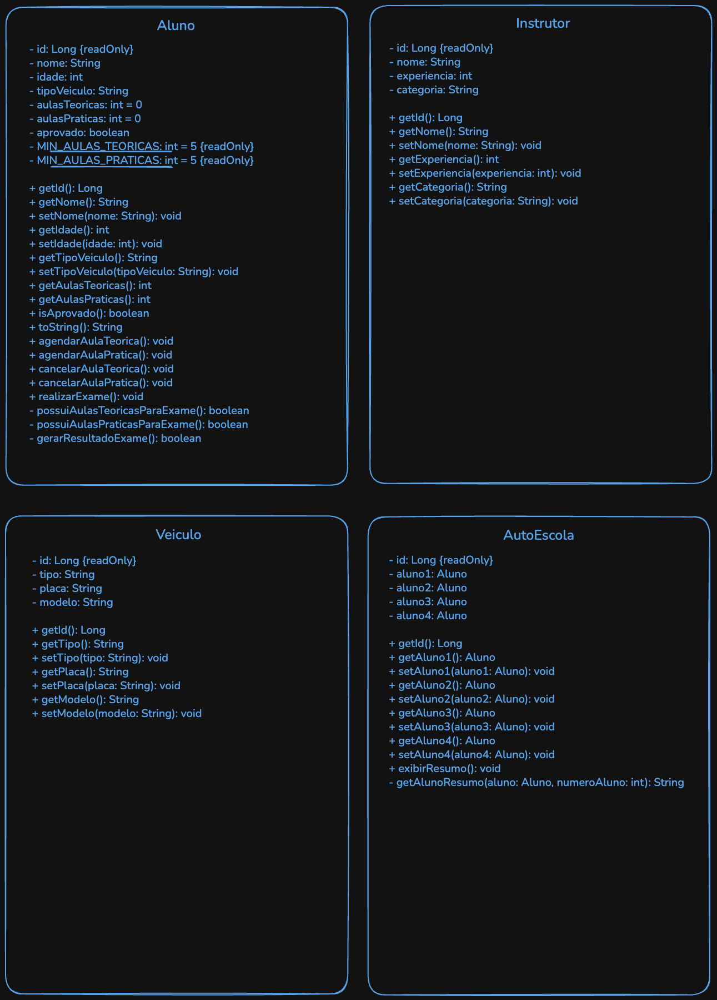

# cp1-ddd-java

# Sistema de Gestão de Autoescola

Projeto desenvolvido para a disciplina de **Domain Driven Design** da **FIAP**, com o objetivo de simular um sistema de gestão de autoescola utilizando os conceitos de **Programação Orientada a Objetos**.

## Integrantes do Grupo

- Beatriz Cortez — 561431
- Bruno Alves — 563986
- Gabriel Augusto — 564126
- Davi de Jesus — 566316

## ⚙Configuração do Ambiente (Java 21)

Este projeto utiliza recursos do **Java 21 LTS**.

### SDKMAN!
O projeto inclui um arquivo `.sdkmanrc`. Para configurar a versão correta, utilize:
```bash
sdk env
```

## Parte 1 - Codificação

Criamos um sistema de autoescola capaz de:

- cadastrar alunos
- cadastrar instrutores
- cadastrar veículos
- agendar aulas teóricas e práticas
- cancelar aulas teóricas e práticas
- realizar exame final
- informar se o aluno foi aprovado ou reprovado

## Parte 2 - Diagrama UML

O Diagrama UML (Unified Modeling Language) criado é uma representação visual padronizada para modelar a estrutura, comportamento e interações do nosso sistema.



## Parte 3 - Perguntas Discursivas

1. **Classes e Objetos:**
   Explique a diferença entre classe e objeto utilizando um exemplo do sistema desenvolvido (Aluno,
   Instrutor, Veículo ou AutoEscola).

    >A principal diferença é que a classe possui consigo um modelo lógico, já o objeto é instânciado a partir dessa classe, possuindo suas características e adicionando dados. 
    Um exemplo em nosso sistema é a Classe Aluno, onde ali criamos os atributos e os métodos (a parte lógica) que utilizamos para criar objetos com as informações dos alunos na classe Main.


2. **Funcionamento do Objeto**
   No método Main, criamos objetos da classe Aluno e chamamos métodos como
   **agendarAulaPratica()** e **cancelarAulaTeorica()**.
   Explique:
   
   A) O que acontece no programa quando executamos a instrução:
   aluno1.agendarAulaPratica();
    
    > Quando executamos essa instrução o sistema realiza a incrementação de +1 no total do atributo aulasPraticas.

   B) Qual atributo da classe Aluno é modificado e por quê?

    > O atributo alterado é o aulasPraticas, que foi criado como um atributo do tipo inteiro que inicializa zerado, então a cada nova chamada da instrução é realizada a incrementação no valor atual do atributo.


3. **Lógica do sistema:**
   No seu código, como o método **realizarExame()** funciona? O que ele verifica antes de determinar
   se o aluno foi aprovado ou não?

    > No método realizarExame, é primeiramente verificado se o aluno tem o número mínimo de aulas práticas e teóricas realizadas,
   utilizando os métodos possuiAulasTeoricasParaExame e possuiAulasPraticasParaExame, dentro da mesma classe.
   Caso não tenha, é exibida uma mensagem informando que ele não atende aos requisitos mínimos e o exame não é realizado.
   Caso tenha, o resultado é gerado aleatoriamente, com o método gerarResultadoExame, exibindo mensagens de aprovação ou reprovação.


4. **Diagrama de Classes:**
   Se quiséssemos adicionar um novo tipo de veículo, como uma bicicleta elétrica, o que
   precisaríamos mudar no diagrama de classes? Explique sua resposta.

    > No diagrama de classes, não seriam necessárias mudanças estruturais na classe Veiculo, pois ela já possui os atributos necessários (id, tipo, placa e modelo) para representar uma bicicleta elétrica.
   > No entanto, para que o sistema aceite esse novo objeto, precisaríamos atualizar a lógica interna do método setTipo(). 
   > <br><br> Atualmente, esse método possui uma lista fixa que permite apenas 'Carro' e 'Moto'. Para incluir a bicicleta elétrica, bastaria adicionar 'Bicicleta Elétrica' à lista de tipos válidos no código, sem alterar a estrutura visual do diagrama.
    


